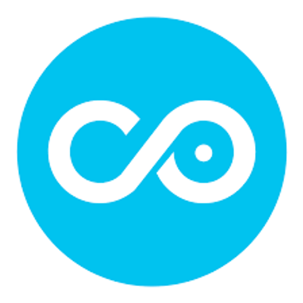
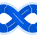
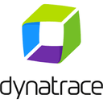
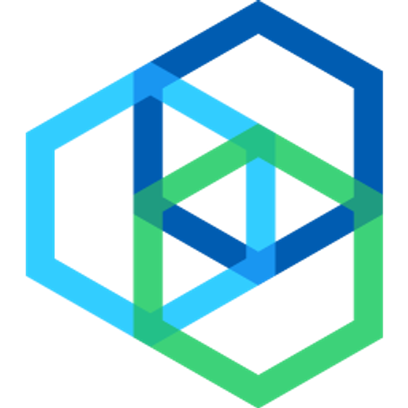

# Resized Icons

## accelQ

| 48px | 64px | 128px | 256px | 512px |
|------|------|-------|-------|-------|
|  |  |  |  |  |

## accesibility

| 48px | 64px | 128px | 256px | 512px |
|------|------|-------|-------|-------|
|  |  |  |  |  |

## acunetix

| 48px | 64px | 128px | 256px | 512px |
|------|------|-------|-------|-------|
|  |  |  |  |  |

## allure_report

| 48px | 64px | 128px | 256px | 512px |
|------|------|-------|-------|-------|
|  |  |  |  |  |

## allure_testops

| 48px | 64px | 128px | 256px | 512px |
|------|------|-------|-------|-------|
|  |  |  |  |  |

## amqp

| 48px | 64px | 128px | 256px | 512px |
|------|------|-------|-------|-------|
|  |  |  |  |  |

## android

| 48px | 64px | 128px | 256px | 512px |
|------|------|-------|-------|-------|
|  |  |  |  |  |

## android_studio

| 48px | 64px | 128px | 256px | 512px |
|------|------|-------|-------|-------|
|  |  |  |  |  |

## apache_jmeter

| 48px | 64px | 128px | 256px | 512px |
|------|------|-------|-------|-------|
|  |  |  |  |  |

## apisecurity

| 48px | 64px | 128px | 256px | 512px |
|------|------|-------|-------|-------|
|  |  |  |  |  |

## apium_device_farm

| 48px | 64px | 128px | 256px | 512px |
|------|------|-------|-------|-------|
|  |  |  |  |  |

## appium

| 48px | 64px | 128px | 256px | 512px |
|------|------|-------|-------|-------|
|  |  |  |  |  |

## appium_inspector

| 48px | 64px | 128px | 256px | 512px |
|------|------|-------|-------|-------|
|  |  |  |  |  |

## appium_pro

| 48px | 64px | 128px | 256px | 512px |
|------|------|-------|-------|-------|
|  |  |  |  |  |

## applitools

| 48px | 64px | 128px | 256px | 512px |
|------|------|-------|-------|-------|
|  |  |  |  |  |

## Artillery

| 48px | 64px | 128px | 256px | 512px |
|------|------|-------|-------|-------|
|  |  |  |  |  |

## asana

| 48px | 64px | 128px | 256px | 512px |
|------|------|-------|-------|-------|
|  |  |  |  |  |

## auth0

| 48px | 64px | 128px | 256px | 512px |
|------|------|-------|-------|-------|
|  |  |  |  |  |

## Automation_Anywhere

| 48px | 64px | 128px | 256px | 512px |
|------|------|-------|-------|-------|
|  |  |  |  |  |

## aws

| 48px | 64px | 128px | 256px | 512px |
|------|------|-------|-------|-------|
|  |  |  |  |  |

## azure_load_test

| 48px | 64px | 128px | 256px | 512px |
|------|------|-------|-------|-------|
|  |  |  |  |  |

## bamboo

| 48px | 64px | 128px | 256px | 512px |
|------|------|-------|-------|-------|
|  |  |  |  |  |

## binary

| 48px | 64px | 128px | 256px | 512px |
|------|------|-------|-------|-------|
|  |  |  |  |  |

## bitbucket

| 48px | 64px | 128px | 256px | 512px |
|------|------|-------|-------|-------|
|  |  |  |  |  |

## biznet_giocloud

| 48px | 64px | 128px | 256px | 512px |
|------|------|-------|-------|-------|
|  |  |  |  |  |

## blazemeter

| 48px | 64px | 128px | 256px | 512px |
|------|------|-------|-------|-------|
|  |  |  |  |  |

## broadcom_sv

| 48px | 64px | 128px | 256px | 512px |
|------|------|-------|-------|-------|
|  |  |  |  |  |

## BrowserAI

| 48px | 64px | 128px | 256px | 512px |
|------|------|-------|-------|-------|
|  |  |  |  |  |

## browserstack

| 48px | 64px | 128px | 256px | 512px |
|------|------|-------|-------|-------|
|  |  |  |  |  |

## BrowserUse

| 48px | 64px | 128px | 256px | 512px |
|------|------|-------|-------|-------|
|  |  |  |  |  |

## burp_suite

| 48px | 64px | 128px | 256px | 512px |
|------|------|-------|-------|-------|
|  |  |  |  |  |

## c#

| 48px | 64px | 128px | 256px | 512px |
|------|------|-------|-------|-------|
|  |  |  |  |  |

## c++

| 48px | 64px | 128px | 256px | 512px |
|------|------|-------|-------|-------|
|  |  |  |  |  |

## c

| 48px | 64px | 128px | 256px | 512px |
|------|------|-------|-------|-------|
|  |  |  |  |  |

## calabash

| 48px | 64px | 128px | 256px | 512px |
|------|------|-------|-------|-------|
|  |  |  |  |  |

## chai

| 48px | 64px | 128px | 256px | 512px |
|------|------|-------|-------|-------|
|  |  |  |  |  |

## chromeOS

| 48px | 64px | 128px | 256px | 512px |
|------|------|-------|-------|-------|
|  |  |  |  |  |

## chrome_dev_toolspng

| 48px | 64px | 128px | 256px | 512px |
|------|------|-------|-------|-------|
|  |  |  |  |  |

## citrus

| 48px | 64px | 128px | 256px | 512px |
|------|------|-------|-------|-------|
|  |  |  |  |  |

## ci_cd

| 48px | 64px | 128px | 256px | 512px |
|------|------|-------|-------|-------|
|  |  |  |  |  |

## clickup

| 48px | 64px | 128px | 256px | 512px |
|------|------|-------|-------|-------|
|  |  |  |  |  |

## CodeceptJS

| 48px | 64px | 128px | 256px | 512px |
|------|------|-------|-------|-------|
|  |  |  |  |  |

## confluence

| 48px | 64px | 128px | 256px | 512px |
|------|------|-------|-------|-------|
|  |  |  |  |  |

## copado

| 48px | 64px | 128px | 256px | 512px |
|------|------|-------|-------|-------|
|  |  |  |  |  |

## coursera

| 48px | 64px | 128px | 256px | 512px |
|------|------|-------|-------|-------|
|  |  |  |  |  |

## csv

| 48px | 64px | 128px | 256px | 512px |
|------|------|-------|-------|-------|
|  |  |  |  |  |

## cucumber

| 48px | 64px | 128px | 256px | 512px |
|------|------|-------|-------|-------|
|  |  |  |  |  |

## cypress

| 48px | 64px | 128px | 256px | 512px |
|------|------|-------|-------|-------|
|  |  |  |  |  |

## datadog

| 48px | 64px | 128px | 256px | 512px |
|------|------|-------|-------|-------|
|  |  |  |  |  |

## devops-loop-illustrations

| 48px | 64px | 128px | 256px | 512px |
|------|------|-------|-------|-------|
|  |  |  |  |  |

## dewaweb

| 48px | 64px | 128px | 256px | 512px |
|------|------|-------|-------|-------|
|  |  |  |  |  |

## discord

| 48px | 64px | 128px | 256px | 512px |
|------|------|-------|-------|-------|
|  |  |  |  |  |

## dynatrace

| 48px | 64px | 128px | 256px | 512px |
|------|------|-------|-------|-------|
|  |  |  |  |  |

## eclipse

| 48px | 64px | 128px | 256px | 512px |
|------|------|-------|-------|-------|
|  |  |  |  |  |

## eggplant

| 48px | 64px | 128px | 256px | 512px |
|------|------|-------|-------|-------|
|  |  |  |  |  |

## elasticsearch

| 48px | 64px | 128px | 256px | 512px |
|------|------|-------|-------|-------|
|  |  |  |  |  |

## erlang

| 48px | 64px | 128px | 256px | 512px |
|------|------|-------|-------|-------|
|  |  |  |  |  |

## espresso

| 48px | 64px | 128px | 256px | 512px |
|------|------|-------|-------|-------|
|  |  |  |  |  |

## firebase

| 48px | 64px | 128px | 256px | 512px |
|------|------|-------|-------|-------|
|  |  |  |  |  |

## Firefox

| 48px | 64px | 128px | 256px | 512px |
|------|------|-------|-------|-------|
|  |  |  |  |  |

## flutter

| 48px | 64px | 128px | 256px | 512px |
|------|------|-------|-------|-------|
|  |  |  |  |  |

## gatling

| 48px | 64px | 128px | 256px | 512px |
|------|------|-------|-------|-------|
|  |  |  |  |  |

## git

| 48px | 64px | 128px | 256px | 512px |
|------|------|-------|-------|-------|
|  |  |  |  |  |

## github

| 48px | 64px | 128px | 256px | 512px |
|------|------|-------|-------|-------|
|  |  |  |  |  |

## gitlab

| 48px | 64px | 128px | 256px | 512px |
|------|------|-------|-------|-------|
|  |  |  |  |  |

## Go-Logo_Blue

| 48px | 64px | 128px | 256px | 512px |
|------|------|-------|-------|-------|
|  |  |  |  |  |

## go

| 48px | 64px | 128px | 256px | 512px |
|------|------|-------|-------|-------|
|  |  |  |  |  |

## google_chrome

| 48px | 64px | 128px | 256px | 512px |
|------|------|-------|-------|-------|
|  |  |  |  |  |

## google_cloud

| 48px | 64px | 128px | 256px | 512px |
|------|------|-------|-------|-------|
|  |  |  |  |  |

## google_doc

| 48px | 64px | 128px | 256px | 512px |
|------|------|-------|-------|-------|
|  |  |  |  |  |

## google_meet

| 48px | 64px | 128px | 256px | 512px |
|------|------|-------|-------|-------|
|  |  |  |  |  |

## grafana

| 48px | 64px | 128px | 256px | 512px |
|------|------|-------|-------|-------|
|  |  |  |  |  |

## graphql

| 48px | 64px | 128px | 256px | 512px |
|------|------|-------|-------|-------|
|  |  |  |  |  |

## groovy

| 48px | 64px | 128px | 256px | 512px |
|------|------|-------|-------|-------|
|  |  |  |  |  |

## grpc

| 48px | 64px | 128px | 256px | 512px |
|------|------|-------|-------|-------|
|  |  |  |  |  |

## HarmonyOS

| 48px | 64px | 128px | 256px | 512px |
|------|------|-------|-------|-------|
|  |  |  |  |  |

## headspin

| 48px | 64px | 128px | 256px | 512px |
|------|------|-------|-------|-------|
|  |  |  |  |  |

## http

| 48px | 64px | 128px | 256px | 512px |
|------|------|-------|-------|-------|
|  |  |  |  |  |

## icons8-tiktok-500

| 48px | 64px | 128px | 256px | 512px |
|------|------|-------|-------|-------|
|  |  |  |  |  |

## idcloudhost

| 48px | 64px | 128px | 256px | 512px |
|------|------|-------|-------|-------|
|  |  |  |  |  |

## influxdb

| 48px | 64px | 128px | 256px | 512px |
|------|------|-------|-------|-------|
|  |  |  |  |  |

## insomnia

| 48px | 64px | 128px | 256px | 512px |
|------|------|-------|-------|-------|
|  |  |  |  |  |

## intellij

| 48px | 64px | 128px | 256px | 512px |
|------|------|-------|-------|-------|
|  |  |  |  |  |

## ios

| 48px | 64px | 128px | 256px | 512px |
|------|------|-------|-------|-------|
|  |  |  |  |  |

## ISO_20022

| 48px | 64px | 128px | 256px | 512px |
|------|------|-------|-------|-------|
|  |  |  |  |  |

## jasmine

| 48px | 64px | 128px | 256px | 512px |
|------|------|-------|-------|-------|
|  |  |  |  |  |

## java

| 48px | 64px | 128px | 256px | 512px |
|------|------|-------|-------|-------|
|  |  |  |  |  |

## javascript

| 48px | 64px | 128px | 256px | 512px |
|------|------|-------|-------|-------|
|  |  |  |  |  |

## jenkins

| 48px | 64px | 128px | 256px | 512px |
|------|------|-------|-------|-------|
|  |  |  |  |  |

## jest

| 48px | 64px | 128px | 256px | 512px |
|------|------|-------|-------|-------|
|  |  |  |  |  |

## jetbrain_aqua

| 48px | 64px | 128px | 256px | 512px |
|------|------|-------|-------|-------|
|  |  |  |  |  |

## jira

| 48px | 64px | 128px | 256px | 512px |
|------|------|-------|-------|-------|
|  |  |  |  |  |

## json

| 48px | 64px | 128px | 256px | 512px |
|------|------|-------|-------|-------|
|  |  |  |  |  |

## junit

| 48px | 64px | 128px | 256px | 512px |
|------|------|-------|-------|-------|
|  |  |  |  |  |

## Jupyter

| 48px | 64px | 128px | 256px | 512px |
|------|------|-------|-------|-------|
|  |  |  |  |  |

## jwt

| 48px | 64px | 128px | 256px | 512px |
|------|------|-------|-------|-------|
|  |  |  |  |  |

## K6

| 48px | 64px | 128px | 256px | 512px |
|------|------|-------|-------|-------|
|  |  |  |  |  |

## kafka

| 48px | 64px | 128px | 256px | 512px |
|------|------|-------|-------|-------|
|  |  |  |  |  |

## kali_linux

| 48px | 64px | 128px | 256px | 512px |
|------|------|-------|-------|-------|
|  |  |  |  |  |

## karate

| 48px | 64px | 128px | 256px | 512px |
|------|------|-------|-------|-------|
|  |  |  |  |  |

## katalon

| 48px | 64px | 128px | 256px | 512px |
|------|------|-------|-------|-------|
|  |  |  |  |  |

## katalon_testOps

| 48px | 64px | 128px | 256px | 512px |
|------|------|-------|-------|-------|
|  |  |  |  |  |

## kibana-periodic

| 48px | 64px | 128px | 256px | 512px |
|------|------|-------|-------|-------|
|  |  |  |  |  |

## kobiton

| 48px | 64px | 128px | 256px | 512px |
|------|------|-------|-------|-------|
|  |  |  |  |  |

## kotest

| 48px | 64px | 128px | 256px | 512px |
|------|------|-------|-------|-------|
|  |  |  |  |  |

## Kotlin_Icon

| 48px | 64px | 128px | 256px | 512px |
|------|------|-------|-------|-------|
|  |  |  |  |  |

## lambdatest

| 48px | 64px | 128px | 256px | 512px |
|------|------|-------|-------|-------|
|  |  |  |  |  |

## leapwork

| 48px | 64px | 128px | 256px | 512px |
|------|------|-------|-------|-------|
|  |  |  |  |  |

## linux

| 48px | 64px | 128px | 256px | 512px |
|------|------|-------|-------|-------|
|  |  |  |  |  |

## linux_mint

| 48px | 64px | 128px | 256px | 512px |
|------|------|-------|-------|-------|
|  |  |  |  |  |

## load_runner

| 48px | 64px | 128px | 256px | 512px |
|------|------|-------|-------|-------|
|  |  |  |  |  |

## locust

| 48px | 64px | 128px | 256px | 512px |
|------|------|-------|-------|-------|
|  |  |  |  |  |

## mabl

| 48px | 64px | 128px | 256px | 512px |
|------|------|-------|-------|-------|
|  |  |  |  |  |

## macos

| 48px | 64px | 128px | 256px | 512px |
|------|------|-------|-------|-------|
|  |  |  |  |  |

## magicpod

| 48px | 64px | 128px | 256px | 512px |
|------|------|-------|-------|-------|
|  |  |  |  |  |

## mariadb

| 48px | 64px | 128px | 256px | 512px |
|------|------|-------|-------|-------|
|  |  |  |  |  |

## mattermost

| 48px | 64px | 128px | 256px | 512px |
|------|------|-------|-------|-------|
|  |  |  |  |  |

## maven

| 48px | 64px | 128px | 256px | 512px |
|------|------|-------|-------|-------|
|  |  |  |  |  |

## metasploit

| 48px | 64px | 128px | 256px | 512px |
|------|------|-------|-------|-------|
|  |  |  |  |  |

## microfocus

| 48px | 64px | 128px | 256px | 512px |
|------|------|-------|-------|-------|
|  |  |  |  |  |

## microfocus_uftone

| 48px | 64px | 128px | 256px | 512px |
|------|------|-------|-------|-------|
|  |  |  |  |  |

## Microsoft-Teams

| 48px | 64px | 128px | 256px | 512px |
|------|------|-------|-------|-------|
|  |  |  |  |  |

## Microsoft_Azure-Logo.wine

| 48px | 64px | 128px | 256px | 512px |
|------|------|-------|-------|-------|
|  |  |  |  |  |

## microsoft_edge

| 48px | 64px | 128px | 256px | 512px |
|------|------|-------|-------|-------|
|  |  |  |  |  |

## microsoft_excell

| 48px | 64px | 128px | 256px | 512px |
|------|------|-------|-------|-------|
|  |  |  |  |  |

## Micro_Focus

| 48px | 64px | 128px | 256px | 512px |
|------|------|-------|-------|-------|
|  |  |  |  |  |

## ministrioftesting

| 48px | 64px | 128px | 256px | 512px |
|------|------|-------|-------|-------|
|  |  |  |  |  |

## MITAPP

| 48px | 64px | 128px | 256px | 512px |
|------|------|-------|-------|-------|
|  |  |  |  |  |

## mitmproxy

| 48px | 64px | 128px | 256px | 512px |
|------|------|-------|-------|-------|
|  |  |  |  |  |

## mocha

| 48px | 64px | 128px | 256px | 512px |
|------|------|-------|-------|-------|
|  |  |  |  |  |

## mocikto

| 48px | 64px | 128px | 256px | 512px |
|------|------|-------|-------|-------|
|  |  |  |  |  |

## monday_logo

| 48px | 64px | 128px | 256px | 512px |
|------|------|-------|-------|-------|
|  |  |  |  |  |

## mongodb

| 48px | 64px | 128px | 256px | 512px |
|------|------|-------|-------|-------|
|  |  |  |  |  |

## mongodb1

| 48px | 64px | 128px | 256px | 512px |
|------|------|-------|-------|-------|
|  |  |  |  |  |

## mqtt

| 48px | 64px | 128px | 256px | 512px |
|------|------|-------|-------|-------|
|  |  |  |  |  |

## mqtt_js

| 48px | 64px | 128px | 256px | 512px |
|------|------|-------|-------|-------|
|  |  |  |  |  |

## mssql

| 48px | 64px | 128px | 256px | 512px |
|------|------|-------|-------|-------|
|  |  |  |  |  |

## mysql

| 48px | 64px | 128px | 256px | 512px |
|------|------|-------|-------|-------|
|  |  |  |  |  |

## nbomber

| 48px | 64px | 128px | 256px | 512px |
|------|------|-------|-------|-------|
|  |  |  |  |  |

## neoload

| 48px | 64px | 128px | 256px | 512px |
|------|------|-------|-------|-------|
|  |  |  |  |  |

## Nessus

| 48px | 64px | 128px | 256px | 512px |
|------|------|-------|-------|-------|
|  |  |  |  |  |

## net_core

| 48px | 64px | 128px | 256px | 512px |
|------|------|-------|-------|-------|
|  |  |  |  |  |

## newrelic

| 48px | 64px | 128px | 256px | 512px |
|------|------|-------|-------|-------|
|  |  |  |  |  |

## nightwatch

| 48px | 64px | 128px | 256px | 512px |
|------|------|-------|-------|-------|
|  |  |  |  |  |

## nikto

| 48px | 64px | 128px | 256px | 512px |
|------|------|-------|-------|-------|
|  |  |  |  |  |

## nmap

| 48px | 64px | 128px | 256px | 512px |
|------|------|-------|-------|-------|
|  |  |  |  |  |

## node_js

| 48px | 64px | 128px | 256px | 512px |
|------|------|-------|-------|-------|
|  |  |  |  |  |

## notion_logo

| 48px | 64px | 128px | 256px | 512px |
|------|------|-------|-------|-------|
|  |  |  |  |  |

## npm

| 48px | 64px | 128px | 256px | 512px |
|------|------|-------|-------|-------|
|  |  |  |  |  |

## nunit

| 48px | 64px | 128px | 256px | 512px |
|------|------|-------|-------|-------|
|  |  |  |  |  |

## Octoperf

| 48px | 64px | 128px | 256px | 512px |
|------|------|-------|-------|-------|
|  |  |  |  |  |

## openID

| 48px | 64px | 128px | 256px | 512px |
|------|------|-------|-------|-------|
|  |  |  |  |  |

## opentext

| 48px | 64px | 128px | 256px | 512px |
|------|------|-------|-------|-------|
|  |  |  |  |  |

## OpenVAS

| 48px | 64px | 128px | 256px | 512px |
|------|------|-------|-------|-------|
|  |  |  |  |  |

## Opkey

| 48px | 64px | 128px | 256px | 512px |
|------|------|-------|-------|-------|
|  |  |  |  |  |

## oracle

| 48px | 64px | 128px | 256px | 512px |
|------|------|-------|-------|-------|
|  |  |  |  |  |

## oracle_cloud

| 48px | 64px | 128px | 256px | 512px |
|------|------|-------|-------|-------|
|  |  |  |  |  |

## OWASP

| 48px | 64px | 128px | 256px | 512px |
|------|------|-------|-------|-------|
|  |  |  |  |  |

## parasoft

| 48px | 64px | 128px | 256px | 512px |
|------|------|-------|-------|-------|
|  |  |  |  |  |

## perfecto

| 48px | 64px | 128px | 256px | 512px |
|------|------|-------|-------|-------|
|  |  |  |  |  |

## PHP

| 48px | 64px | 128px | 256px | 512px |
|------|------|-------|-------|-------|
|  |  |  |  |  |

## phpstorm

| 48px | 64px | 128px | 256px | 512px |
|------|------|-------|-------|-------|
|  |  |  |  |  |

## phpunittest

| 48px | 64px | 128px | 256px | 512px |
|------|------|-------|-------|-------|
|  |  |  |  |  |

## playwright

| 48px | 64px | 128px | 256px | 512px |
|------|------|-------|-------|-------|
|  |  |  |  |  |

## pluralsight_logo

| 48px | 64px | 128px | 256px | 512px |
|------|------|-------|-------|-------|
|  |  |  |  |  |

## postgresql

| 48px | 64px | 128px | 256px | 512px |
|------|------|-------|-------|-------|
|  |  |  |  |  |

## postman

| 48px | 64px | 128px | 256px | 512px |
|------|------|-------|-------|-------|
|  |  |  |  |  |

## prometheus

| 48px | 64px | 128px | 256px | 512px |
|------|------|-------|-------|-------|
|  |  |  |  |  |

## protactor

| 48px | 64px | 128px | 256px | 512px |
|------|------|-------|-------|-------|
|  |  |  |  |  |

## provar

| 48px | 64px | 128px | 256px | 512px |
|------|------|-------|-------|-------|
|  |  |  |  |  |

## Puppeteer

| 48px | 64px | 128px | 256px | 512px |
|------|------|-------|-------|-------|
|  |  |  |  |  |

## pyautogui

| 48px | 64px | 128px | 256px | 512px |
|------|------|-------|-------|-------|
|  |  |  |  |  |

## pycharm

| 48px | 64px | 128px | 256px | 512px |
|------|------|-------|-------|-------|
|  |  |  |  |  |

## pytest

| 48px | 64px | 128px | 256px | 512px |
|------|------|-------|-------|-------|
|  |  |  |  |  |

## pytest_html

| 48px | 64px | 128px | 256px | 512px |
|------|------|-------|-------|-------|
|  |  |  |  |  |

## python

| 48px | 64px | 128px | 256px | 512px |
|------|------|-------|-------|-------|
|  |  |  |  |  |

## qase

| 48px | 64px | 128px | 256px | 512px |
|------|------|-------|-------|-------|
|  |  |  |  |  |

## rabbitmq

| 48px | 64px | 128px | 256px | 512px |
|------|------|-------|-------|-------|
|  |  |  |  |  |

## ranorex

| 48px | 64px | 128px | 256px | 512px |
|------|------|-------|-------|-------|
|  |  |  |  |  |

## raspberri_pi

| 48px | 64px | 128px | 256px | 512px |
|------|------|-------|-------|-------|
|  |  |  |  |  |

## redis

| 48px | 64px | 128px | 256px | 512px |
|------|------|-------|-------|-------|
|  |  |  |  |  |

## Red_Hat

| 48px | 64px | 128px | 256px | 512px |
|------|------|-------|-------|-------|
|  |  |  |  |  |

## reportal

| 48px | 64px | 128px | 256px | 512px |
|------|------|-------|-------|-------|
|  |  |  |  |  |

## requests

| 48px | 64px | 128px | 256px | 512px |
|------|------|-------|-------|-------|
|  |  |  |  |  |

## rest

| 48px | 64px | 128px | 256px | 512px |
|------|------|-------|-------|-------|
|  |  |  |  |  |

## restsharp

| 48px | 64px | 128px | 256px | 512px |
|------|------|-------|-------|-------|
|  |  |  |  |  |

## rest_assured

| 48px | 64px | 128px | 256px | 512px |
|------|------|-------|-------|-------|
|  |  |  |  |  |

## rider

| 48px | 64px | 128px | 256px | 512px |
|------|------|-------|-------|-------|
|  |  |  |  |  |

## robot_framework

| 48px | 64px | 128px | 256px | 512px |
|------|------|-------|-------|-------|
|  |  |  |  |  |

## ruby

| 48px | 64px | 128px | 256px | 512px |
|------|------|-------|-------|-------|
|  |  |  |  |  |

## saucelab

| 48px | 64px | 128px | 256px | 512px |
|------|------|-------|-------|-------|
|  |  |  |  |  |

## selectorhub

| 48px | 64px | 128px | 256px | 512px |
|------|------|-------|-------|-------|
|  |  |  |  |  |

## selendroid

| 48px | 64px | 128px | 256px | 512px |
|------|------|-------|-------|-------|
|  |  |  |  |  |

## selenium

| 48px | 64px | 128px | 256px | 512px |
|------|------|-------|-------|-------|
|  |  |  |  |  |

## simcard

| 48px | 64px | 128px | 256px | 512px |
|------|------|-------|-------|-------|
|  |  |  |  |  |

## slack

| 48px | 64px | 128px | 256px | 512px |
|------|------|-------|-------|-------|
|  |  |  |  |  |

## smartbear_testcomplete

| 48px | 64px | 128px | 256px | 512px |
|------|------|-------|-------|-------|
|  |  |  |  |  |

## snyk

| 48px | 64px | 128px | 256px | 512px |
|------|------|-------|-------|-------|
|  |  |  |  |  |

## soap

| 48px | 64px | 128px | 256px | 512px |
|------|------|-------|-------|-------|
|  |  |  |  |  |

## soapui

| 48px | 64px | 128px | 256px | 512px |
|------|------|-------|-------|-------|
|  |  |  |  |  |

## sonarqube

| 48px | 64px | 128px | 256px | 512px |
|------|------|-------|-------|-------|
|  |  |  |  |  |

## sqlite

| 48px | 64px | 128px | 256px | 512px |
|------|------|-------|-------|-------|
|  |  |  |  |  |

## Sqlmap_logo

| 48px | 64px | 128px | 256px | 512px |
|------|------|-------|-------|-------|
|  |  |  |  |  |

## sublime_text

| 48px | 64px | 128px | 256px | 512px |
|------|------|-------|-------|-------|
|  |  |  |  |  |

## swagger

| 48px | 64px | 128px | 256px | 512px |
|------|------|-------|-------|-------|
|  |  |  |  |  |

## taurus

| 48px | 64px | 128px | 256px | 512px |
|------|------|-------|-------|-------|
|  |  |  |  |  |

## tcp

| 48px | 64px | 128px | 256px | 512px |
|------|------|-------|-------|-------|
|  |  |  |  |  |

## testcafe

| 48px | 64px | 128px | 256px | 512px |
|------|------|-------|-------|-------|
|  |  |  |  |  |

## testmo

| 48px | 64px | 128px | 256px | 512px |
|------|------|-------|-------|-------|
|  |  |  |  |  |

## testng

| 48px | 64px | 128px | 256px | 512px |
|------|------|-------|-------|-------|
|  |  |  |  |  |

## testomatio

| 48px | 64px | 128px | 256px | 512px |
|------|------|-------|-------|-------|
|  |  |  |  |  |

## testrail

| 48px | 64px | 128px | 256px | 512px |
|------|------|-------|-------|-------|
|  |  |  |  |  |

## testrigor

| 48px | 64px | 128px | 256px | 512px |
|------|------|-------|-------|-------|
|  |  |  |  |  |

## testsigma

| 48px | 64px | 128px | 256px | 512px |
|------|------|-------|-------|-------|
|  |  |  |  |  |

## test_autoamtion_university

| 48px | 64px | 128px | 256px | 512px |
|------|------|-------|-------|-------|
|  |  |  |  |  |

## tevern

| 48px | 64px | 128px | 256px | 512px |
|------|------|-------|-------|-------|
|  |  |  |  |  |

## Trello-Logo

| 48px | 64px | 128px | 256px | 512px |
|------|------|-------|-------|-------|
|  |  |  |  |  |

## tricentis_testim

| 48px | 64px | 128px | 256px | 512px |
|------|------|-------|-------|-------|
|  |  |  |  |  |

## tricentis_tosca_logo

| 48px | 64px | 128px | 256px | 512px |
|------|------|-------|-------|-------|
|  |  |  |  |  |

## typescript

| 48px | 64px | 128px | 256px | 512px |
|------|------|-------|-------|-------|
|  |  |  |  |  |

## ubuntu

| 48px | 64px | 128px | 256px | 512px |
|------|------|-------|-------|-------|
|  |  |  |  |  |

## udemy_logo

| 48px | 64px | 128px | 256px | 512px |
|------|------|-------|-------|-------|
|  |  |  |  |  |

## uipath

| 48px | 64px | 128px | 256px | 512px |
|------|------|-------|-------|-------|
|  |  |  |  |  |

## unittest

| 48px | 64px | 128px | 256px | 512px |
|------|------|-------|-------|-------|
|  |  |  |  |  |

## unit_testing

| 48px | 64px | 128px | 256px | 512px |
|------|------|-------|-------|-------|
|  |  |  |  |  |

## visual_studio_code

| 48px | 64px | 128px | 256px | 512px |
|------|------|-------|-------|-------|
|  |  |  |  |  |

## watir

| 48px | 64px | 128px | 256px | 512px |
|------|------|-------|-------|-------|
|  |  |  |  |  |

## webdriverio

| 48px | 64px | 128px | 256px | 512px |
|------|------|-------|-------|-------|
|  |  |  |  |  |

## webkit

| 48px | 64px | 128px | 256px | 512px |
|------|------|-------|-------|-------|
|  |  |  |  |  |

## WebLOAD

| 48px | 64px | 128px | 256px | 512px |
|------|------|-------|-------|-------|
|  |  |  |  |  |

## websocket

| 48px | 64px | 128px | 256px | 512px |
|------|------|-------|-------|-------|
|  |  |  |  |  |

## winappdriver

| 48px | 64px | 128px | 256px | 512px |
|------|------|-------|-------|-------|
|  |  |  |  |  |

## Windows-New-Logo

| 48px | 64px | 128px | 256px | 512px |
|------|------|-------|-------|-------|
|  |  |  |  |  |

## windows

| 48px | 64px | 128px | 256px | 512px |
|------|------|-------|-------|-------|
|  |  |  |  |  |

## windows_server

| 48px | 64px | 128px | 256px | 512px |
|------|------|-------|-------|-------|
|  |  |  |  |  |

## wiremock

| 48px | 64px | 128px | 256px | 512px |
|------|------|-------|-------|-------|
|  |  |  |  |  |

## wireshark

| 48px | 64px | 128px | 256px | 512px |
|------|------|-------|-------|-------|
|  |  |  |  |  |

## worksoft

| 48px | 64px | 128px | 256px | 512px |
|------|------|-------|-------|-------|
|  |  |  |  |  |

## xcode

| 48px | 64px | 128px | 256px | 512px |
|------|------|-------|-------|-------|
|  |  |  |  |  |

## xcode_accessibility

| 48px | 64px | 128px | 256px | 512px |
|------|------|-------|-------|-------|
|  |  |  |  |  |

## xml

| 48px | 64px | 128px | 256px | 512px |
|------|------|-------|-------|-------|
|  |  |  |  |  |

## xray

| 48px | 64px | 128px | 256px | 512px |
|------|------|-------|-------|-------|
|  |  |  |  |  |

## xunit

| 48px | 64px | 128px | 256px | 512px |
|------|------|-------|-------|-------|
|  |  |  |  |  |

## yaml

| 48px | 64px | 128px | 256px | 512px |
|------|------|-------|-------|-------|
|  |  |  |  |  |

## zabbix

| 48px | 64px | 128px | 256px | 512px |
|------|------|-------|-------|-------|
|  |  |  |  |  |

## zoom

| 48px | 64px | 128px | 256px | 512px |
|------|------|-------|-------|-------|
|  |  |  |  |  |

